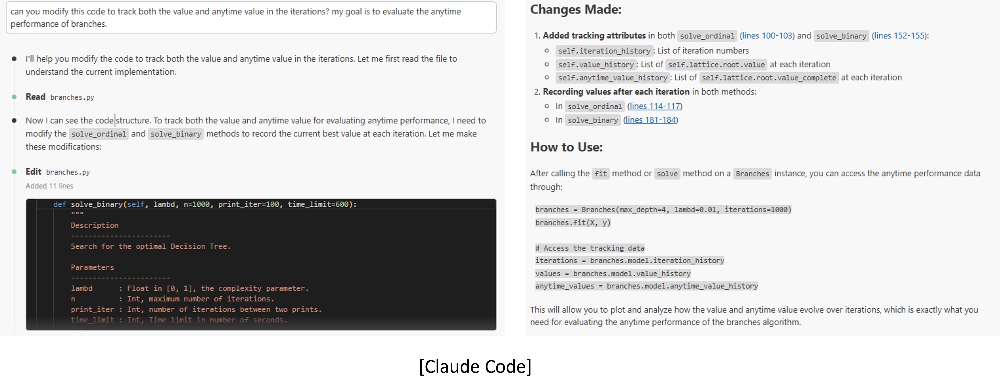
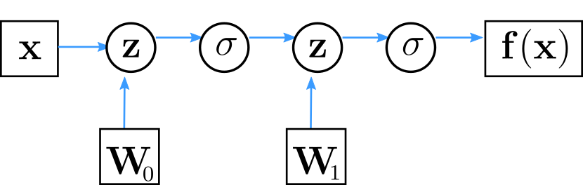

# Deep Learning: Introduction to Deep Learning

```
$ echo "Data Sciences Institute"
```

---

# Warning: This lecture is more theoretical compared to the other lectures.

---

# Goal of the class

## Overview

* When and where to use DL
* "How" it works
* Frontiers of DL

## Using DL

* Implement using `Numpy`, and `Tensorflow` (`Keras`)
* Engineering knowledge for building and training DL

---
# What is Deep Learning

* Good old Neural Networks, with more layers/modules
* Non-linear, hierarchical, abstract representations of data
* Flexible models with any input/output type and size
* Differentiable Functional Programming

---
# Why Deep Learning Now?

* Better algorithms & understanding

---
# Why Deep Learning Now?

* Computing power (GPUs, TPUs, ...)


*GPU and TPU*

---
# Why Deep Learning Now?

* Data with labels


*Adapted from Andrew Ng*

---
# Why Deep Learning Now?

* Open source tools and models


---
# DL Today: Speech-to-Text


---
# DL Today: Vision


---
# DL Today: Vision


---
# DL Today: NLP


---
# DL Today: NLP


---
# DL Today: Vision + NLP


---
# DL Today: Image translation


---
# DL Today: Generative models


StackGAN v2 [Zhang 2017]

---
# DL Today: Generative models

Guess which one is generated?


---
# DL Today: Generative models



---

# DL in Science: Genomics


---

# DL in Science: Genomics


[AlphaFold by DeepMind](https://deepmind.com/blog/article/alphafold-a-solution-to-a-50-year-old-grand-challenge-in-biology)

---

# DL in Science: Chemistry, Physics


---

# DL in Science: Chemistry, Physics


Finite element simulator accelerated (~100 fold) by a 3D convolutional network

---
# DL for AI in games

 

AlphaGo/Zero: Monte Carlo Tree Search, Deep Reinforcement Learning, self-play 

---
# Outline of the class

* Backpropagation
* Computer Vision
* Recommender Systems
* Natural Language Processing
* Optimization: theory, methods and tricks
* Generative models & unsupervised learning

---

# How this course works works

* Lectures ~1 hour
* Break ~15 minutes
* Practical session ~1 hour
    * Work in breakout groups and discuss!
    * Homework: complete the lab
* Two assignments
    * One due at the end of week 1, one at the end of week 2

---

# Frameworks and Computation Graphs

---
# Libraries & Frameworks


This lecture is using **Keras**: high level frontend for **TensorFlow** (and MXnet, Theano, CNTK)

One lab will be dedicated to a short **Pytorch** introduction.

---
# Computation Graph


Neural network = parametrized, non-linear function

---
# Computation Graph



Computation graph: Directed graph of functions, depending on parameters (neuron weights)

---

# Computation Graph


Combination of linear (parametrized) and non-linear functions

---

# Computation Graph


Not only sequential application of functions

---

# Computation Graph


* Automatic computation of gradients: all modules are **differentiable**!
* Theano (now Aesara), **Tensorflow 1**, etc. build a static computation graph via static declarations.
* **Tensorflow 2**, **PyTorch**, **JAX**, etc. rely on dynamic differentiable modules: "define-by-run".
* Vector computation on **CPU** and accelerators (**GPU** and **TPU**).

---

# Computation Graph


Simple keras implementation

```py
model = Sequential()
model.add(Dense(H, input_dim=N))  # defines W0
model.add(Activation("tanh"))
model.add(Dense(K))               # defines W1
model.add(Activation("softmax"))
```

---

# Next: Lab 1!
