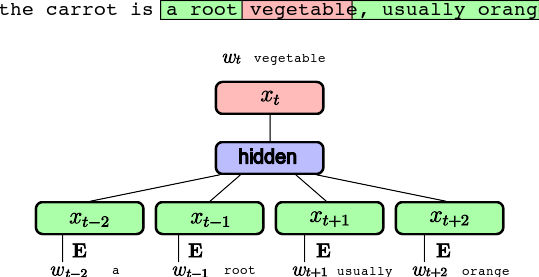
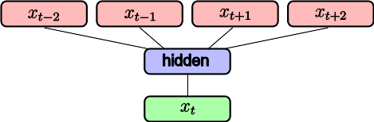
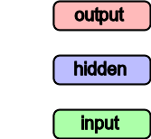
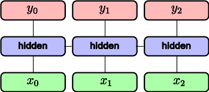

# Deep Learning: Natural Language Processing with Deep Learning

```
$ echo "Data Sciences Institute"
```

---

## Natural Language Processing


---

## Natural Language Processing

* Sentence/Document level Classification (topic, sentiment)
* Topic modeling (LDA, ...)
* Translation
* Chatbots / dialogue systems / assistants (Alexa, ...)
* Summarization

Useful open source projects


---

# Outline

* Classification and word representation
* Word2Vec
* Language Modelling
* Recurrent neural networks

---

# Word Representation and Word2Vec

---

# Word representation

* Words are indexed and represented as 1-hot vectors
* Large Vocabulary of possible words $|V|$
* Use of **Embeddings** as inputs in all Deep NLP tasks
* Word embeddings usually have dimensions 50, 100, 200, 300

---

# Supervised Text Classification


* $\mathbf{E}$ embedding (linear projection) $\rightarrow$ `|V| x H`
* Embeddings are averaged $\rightarrow$ hidden activation size: `H`
* Dense output connection $\mathbf{W}, \mathbf{b}$ $\rightarrow$ `H x K`
* Softmax and **cross-entropy** loss

Joulin, Armand, et al. "Bag of tricks for efficient text classification." FAIR 2016

<!-- Question: shape of embeddings if hidden size is H -->

---

# Supervised Text Classification


* Very efficient (**speed** and **accuracy**) on large datasets
* State-of-the-art (or close to) on several classification, when adding **bigrams/trigrams**
* Little gains from depth

Joulin, Armand, et al. "Bag of tricks for efficient text classification." FAIR 2016

---

# Transfer Learning for Text

Similar to image: can we have word representations that are generic
enough to **transfer** from one task to another?

**Unsupervised / self-supervised** learning of word representations

**Unlabelled** text data is almost infinite:
  - Wikipedia dumps
  - Project Gutenberg
  - Social Networks
  - Common Crawl

---
# Word Vectors


excerpt from work by J. Turian on a model trained by R. Collobert et al. 2008

<!-- Question: what distance to use in such a space -->

---

# Word2Vec


### Compositionality


Colobert et al. 2011, Mikolov, et al. 2013

---

# Word Analogies


* Linear relations in Word2Vec embeddings
* Many come from text structure (e.g. Wikipedia)

Mikolov, Tomas, et al. "Distributed representations of words and phrases and their compositionality." NIPS 2013

---

# Self-supervised training

Distributional Hypothesis (Harris, 1954):
*“words are characterized by the company that they keep”*

Main idea: learning word embeddings by **predicting word contexts**

Given a word e.g. “carrot” and any other word $w \in V$ predict
probability $P(w|\text{carrot})$ that $w$ occurs in the context of
“carrot”.

* **Unsupervised / self-supervised**: no need for class labels.
* (Self-)supervision comes from **context**.
* Requires a lot of text data to cover rare words correctly.

Mikolov, Tomas, et al. "Distributed representations of words and phrases and their compositionality." NIPS 2013

<!-- How to train fastText like model on this? -->

---

# Word2Vec: CBoW

CBoW: representing the context as **Continuous Bag-of-Words**

Self-supervision from large unlabeled corpus of text: *slide* over an **anchor word** and its **context**:



Mikolov, Tomas, et al. "Distributed representations of words and phrases and their compositionality." NIPS 2013

<!-- Question: dim of output embedding vs dim of input embedding -->

---
# Word2Vec: Skip Gram



* Given the central word, predict occurrence of other words in its context.
* Widely used in practice

---

# Word2Vec: Negative Sampling

* Task is simplified further: **binary classification** of word pairs
* For the sentence "The quick brown fox jumps over the lazy dog":
* "quick" and "fox" are positive examples (if context window is 2)
* "quick" and "apple" are negative examples
* By sampling negative examples, we don't just bring similar words' embeddings closer, but also push away dissimilar words' embeddings.

---

# Transformer-based methods

* **Attention** mechanism: more recent and more powerful than Word2Vec
* **BERT** (Bidirectional Encoder Representations from Transformers) allows for **contextual embeddings** (different embeddings for the same word in different contexts)
* For example, "bank" in "river bank" and "bank account" will have different embeddings
* This means converting a word to a vector is no longer a simple lookup in a table, but a function of the entire sentence

---

# Transformer-based methods

* **Sub-word tokenization**: BERT uses a sub-word tokenization, which allows it to handle out-of-vocabulary words better than Word2Vec
* For example, "unbelievable" can be split into "un" and "believable"
* This means that the model can guess the meaning of words it has never seen before, based on the meanings of their parts
* OpenAI tokenization example: [https://platform.openai.com/tokenizer](https://platform.openai.com/tokenizer)

---

# Take Away on Embeddings

**For text applications, inputs of Neural Networks are Embeddings**

* If **little training data** and a wide vocabulary not well covered by training data, use **pre-trained self-supervised embeddings** (word2vec, or with more time and resources, BERT, GPT, etc.)
* If **large training data** with labels, directly learn task-specific embedding for more precise representation.
* word2vec uses **Bag-of-Words** (BoW): they **ignore the order** in word sequences
* Depth & non-linear activations on hidden layers are not that useful for BoW text classification.

---

# Language Modelling and Recurrent Neural Networks

---

## Language Models

Assign a probability to a sequence of words, such that plausible sequences have
higher probabilities e.g:

* $p(\text{"I like cats"}) > p(\text{"I table cats"})$
* $p(\text{"I like cats"}) > p(\text{"like I cats"})$

Likelihoods are factorized:

$p_{\theta}(w_{0}) \cdot p_{\theta}(w_{1} | w_{0}) \cdot \ldots \cdot p_{\theta}(w_n | w_{n-1}, w_{n-2}, \ldots, w_0)$
$p_{\theta}$ is parametrized by a neural network.

The internal representation of the model can better capture the meaning
of a sequence than a simple Bag-of-Words.

---
## Conditional Language Models

NLP problems expressed as **Conditional Language Models**:
**Translation:** $p(Target | Source)$
* *Source*: "J'aime les chats"
* *Target*: "I like cats"

Model the output word by word:

$p_{\theta}(w_{0} | Source) \cdot p_{\theta}(w_{1} | w_{0}, Source) \cdot \ldots$

---

## Conditional Language Models

**Question Answering / Dialogue:**

$p( Answer | Question , Context )$

* *Context*:
  - "John puts two glasses on the table."
  - "Bob adds two more glasses."
  - "Bob leaves the kitchen to play baseball in the garden."
* *Question*: "How many glasses are there?"
* *Answer*: "There are four glasses."

**Image Captionning:** $p( Caption | Image )$
* Image is usually the $2048$-d representation from a CNN

<!-- Question: do you have any idea of those NLP tasks that could be tackled with a similar conditional modeling approach? -->

---

## Simple Language Model


## Fixed context size

* **Average embeddings**: (same as CBoW) no sequence information
* **Concatenate embeddings**: introduces many parameters
* Still does not take well into account varying sequence sizes and sequence dependencies

<!-- Question: What's the dimension of concatenate embeddings? -->

---

## Recurrent Neural Network




Unroll over a sequence $(x_0, x_1, x_2)$:



---

## Language Modelling


**input** $(w_0, w_1, ..., w_t)$  sequence of words ( 1-hot encoded )
**output** $(w_1, w_2, ..., w_{t+1})$ shifted sequence of words ( 1-hot encoded ) 

---

## Language Modelling


$x_t = \text{Emb}(w_t) = \mathbf{E} w_t$ $\rightarrow$ input projection `H`

$h_t = g(\mathbf{W^h} h_{t-1} + x_t + b^h)$ $\rightarrow$ recurrent connection `H`

$y = \text{softmax}( \mathbf{W^o} h_t + b^o )$ $\rightarrow$ output projection `K = |V|`

---

## Recurrent Neural Network


Input embedding $\mathbf{E}$  $\rightarrow$ `|V| x H`

Recurrent weights $\mathbf{W^h}$  $\rightarrow$ `H x H`

Output weights $\mathbf{W^{out}}$ $\rightarrow$  `H x K = H x |V|`

---

## Backpropagation through time

Similar as standard backpropagation on unrolled network


* Similar as training **very deep networks** with tied parameters
* Example between $x_0$ and $y_2$: $W^h$ is used twice
* Usually truncate the backprop after $T$ timesteps
* Difficulties to train long-term dependencies

---

## Other uses: Sentiment Analysis


* Output is sentiment (1 for positive, 0 for negative)
* Very dependent on words order
* Very flexible network architectures

---

## Other uses: Sentiment analysis


* Output is sentiment (1 for positive, 0 for negative)
* Very dependent on words order
* Very flexible network architectures


---

# LSTM


* 4 times more parameters than RNN
* Mitigates **vanishing gradient** problem through **gating**
* Widely used and SOTA in many sequence learning problems

Hochreiter, Sepp, and Jürgen Schmidhuber. "Long short-term memory." Neural computation 1997

---

## Vanishing / Exploding Gradients

Passing through $t$ time-steps, the resulting gradient is the **product** of many gradients and activations.
* Gradient messages close to $0$ can shrink be $0$
* Gradient messages larger than $1$ can explode
* **LSTM** mitigates that in RNNs
* **Additive path** between $c_t$ and $c_{t-1}$
* **Gradient clipping** prevents gradient explosion
* Well chosen **activation function** is critical (tanh)
**Skip connections** in ResNet also alleviate a similar optimization problem.

---

# Next: Lab 6!
