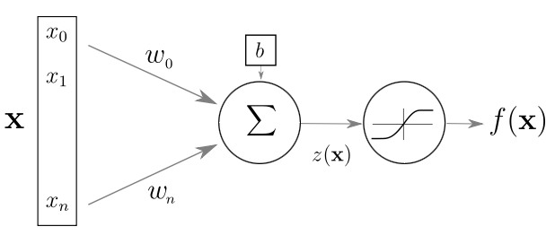
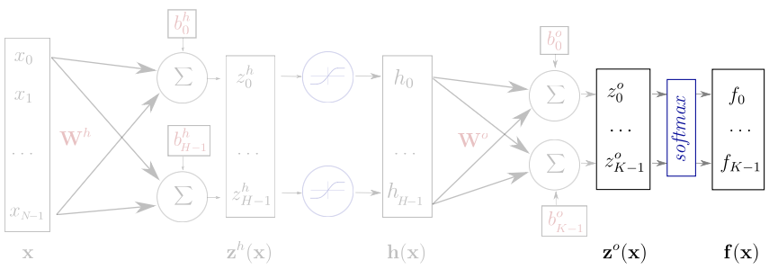
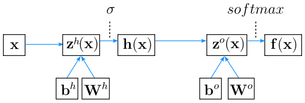
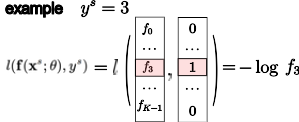

# Neural networks and Backpropagation

<!--
Warning: This lecture is more theoretical compared to the other lectures.
-->

---

# Yesterday

* Overview
* Computation graph view of neural networks
* Linear operation followed by non-linear activation
...But what is the linear operation, really?

# Today

* A closer look at what's going on in a "neuron"
* Backpropagation: how do we train a neural network?

---
# Neural Network for classification

Vector function with tunable parameters $\theta$

$$
\mathbf{f}(\cdot; \mathbf{\theta}): \mathbb{R}^N \rightarrow (0, 1)^K
$$

Sample $s$ in dataset $S$:
  - input: $\mathbf{x}^s \in \mathbb{R}^N$
  - expected output: $y^s \in [0, K-1]$

Output is a conditional probability distribution:

$
\mathbf{f}(\mathbf{x}^s;\mathbf{\theta})_c = P(Y=c|X=\mathbf{x}^s)
$

<!-- 
the model parametrizes a conditional distribution of Y given X

example:

- x is the vector of the pixel values of an photo in an online fashion
  store
- y is the type of the piece of closing (shoes, dress, shirt) represented
  in the photo 
-->
---

# Artificial Neuron



$z(\mathbf{x}) = \mathbf{w}^T \mathbf{x} + b$

$f(\mathbf{x}) = g(\mathbf{w}^T \mathbf{x} + b)$

- $\mathbf{x}, f(\mathbf{x}) \,\,$    input and output
- $z(\mathbf{x})\,\,$    pre-activation
- $\mathbf{w}, b\,\,$    weights and bias
- $g$ activation function

<!-- 
McCullot & pitts: inspiration from brain, but simplistic model with no will to be close to biology 
-->
---
# Concrete Example

* Say we have two input dimensions $x_1$ and $x_2$ and one output dimension f(x) (sometimes, $\hat{y}$  - the predicted value of y - is used instead of $f(x)$)

* Our weights and biases could be $W=[3,−2]$ and $b=1$

* Our non-linearity could be ReLU: $g(z)=max(0,z)$

* Now $z(x)=3x1−2x_2+1$ and $f(x)=max(0,3x_1−2x_2+1)$

* Every neuron in a neural network is a function like this!

---

# Layer of Neurons (Vectorization)


$\mathbf{f}(\mathbf{x}) = g(\textbf{z(x)}) = g(\mathbf{W}  \mathbf{x} + \mathbf{b})$
- $\mathbf{W}, \mathbf{b}\,\,$    now matrix and vector

---
# One Hidden Layer Network


- $\mathbf{z}^h(\mathbf{x}) = \mathbf{W}^h \mathbf{x} + \mathbf{b}^h$

<!-- 
also named multi-layer perceptron (MLP)
feed forward, fully connected neural network
logistic regression is the same without the hidden layer 
-->

---
# One Hidden Layer Network


- $\mathbf{h}(\mathbf{x}) = g(\mathbf{z}^h(\mathbf{x})) = g(\mathbf{W}^h \mathbf{x}$

---
# One Hidden Layer Network


- $\mathbf{z}^o(\mathbf{x}) = \mathbf{W}^o \mathbf{h}(\mathbf{x}) + \mathbf{b}^o$

---
# One Hidden Layer Network



- $\mathbf{f}(\mathbf{x}) = softmax(\mathbf{z}^o) = softmax(\mathbf{W}^o \mathbf{h}(\mathbf{x}) + \mathbf{b}^o)$

---

# One Hidden Layer Network


### Alternate representation



---
# One Hidden Layer Network


### Keras implementation
```py
model = Sequential()
model.add(Dense(H, input_dim=N))  # weight matrix dim [N * H]
model.add(Activation("tanh"))
model.add(Dense(K))               # weight matrix dim [H x K]
model.add(Activation("softmax"))
```

---

# Element-wise activation functions


* blue: activation function
* green: derivative

<!-- 
todo: add legend
-->

---
# Softmax function

$$
softmax(\mathbf{x}) = \frac{1}{\sum_{i=1}^{n}{e^{x_i}}}
\cdot
\begin{bmatrix}
  e^{x_1}\\\\
  e^{x_2}\\\\
  \vdots\\\\
  e^{x_n}
\end{bmatrix}
$$

<!-- 
$$
\frac{\partial softmax(\mathbf{x})_i}{\partial x_j} =
\begin{cases}
softmax(\mathbf{x})_i \cdot (1 - softmax(\mathbf{x})_i) & i = j\\\\
-softmax(\mathbf{x})_i \cdot softmax(\mathbf{x})_j & i \neq j
\end{cases}
$$
-->

- vector of values in (0, 1) that add up to 1
- for example, $\mathbf{x}=[1,2,3]$ becomes $\frac{1}{e^1+e^2+e^3}\cdot[e^1,e^2,e^3]^T=[0.09,0.24,0.67]$
- $p(Y = c|X = \mathbf{x}) = \text{softmax}(\mathbf{z}(\mathbf{x}))_c$
- the pre-activation vector $\mathbf{z}(\mathbf{x})$ is often called "the logits"

---
# Training the network

Find parameters that minimize the **negative log likelihood** (or [cross entropy](
https://en.wikipedia.org/wiki/Cross_entropy#Cross-entropy_loss_function_and_logistic_regression))

<!-- 
$\mathbf{\theta} = ( \mathbf{W}^h; \mathbf{b}^h; \mathbf{W}^o; \mathbf{b}^o )$ 
-->

The loss function for a given sample $s \in S$:

$$
l(\mathbf{f}(\mathbf{x}^s;\theta), y^s) =  nll(\mathbf{x}^s, y^s; \theta) = -\log \mathbf{f}(\mathbf{x}^s;\theta)_{y^s}
$$



<!-- 
Minimizing a cost function that depends on a finite training set belong to the framework
of Empirical Risk Minimization.

Adding a regularization term to the cost function Maximum A Posteriori

https://en.wikipedia.org/wiki/Cross_entropy#Cross-entropy_loss_function_and_logistic_regression 
-->

---
# Training the network

Find parameters $\mathbf{\theta} = ( \mathbf{W}^h; \mathbf{b}^h; \mathbf{W}^o; \mathbf{b}^o )$ that minimize the **negative log likelihood** (or [cross entropy](https://en.wikipedia.org/wiki/Cross_entropy#Cross-entropy_loss_function_and_logistic_regression))

The loss function for a given sample $s \in S$:

$$
l(\mathbf{f}(\mathbf{x}^s;\theta), y^s) = nll(\mathbf{x}^s, y^s; \theta) = -\log \mathbf{f}(\mathbf{x}^s;\theta)_{y^s}
$$

The cost function is the negative likelihood of the model computed on the full
training set (for i.i.d. samples):

$$
L_S(\theta) = -\frac{1}{|S|} \sum_{s \in S} \log \mathbf{f}(\mathbf{x}^s;\theta)_{y^s}
$$

<!-- 
$\lambda \Omega(\mathbf{\theta}) = \lambda (||W^h||^2 + ||W^o||^2)$ is an optional regularization term.

Minimizing a cost function that depends on a finite training set belong to the framework
of Empirical Risk Minimization.

Adding a regularization term to the cost function Maximum A Posteriori
-->

---

# Training the network

* Now we have a mathematical function representing the network
* And we have a way of measuring how good it is
* How do we find the parameters that minimize the loss?

---

# Gradient Descent

* Let's imagine we only have one parameter $\theta$
* We can compute the derivative of the loss with respect to $\theta$
* The derivative, $\frac{dL}{d\theta}$, tells us the slope of the loss function at a given point
* If $\frac{dL}{d\theta}>0$, increasing $\theta$ will increase the loss, and vice versa
* To minimize loss, we adjust $\theta$ in the opposite direction of $\frac{dL}{d\theta}$
* This is done using the update rule: $\theta=\theta_{old}−\eta\frac{dL}{d\theta}$

---

# Gradient Descent

* We can use gradient descent to play "guess what number I'm thinking of"
* If your guess is too high, you decrease it
* If your guess is too low, you increase it
* The error function is a parabola
* By finding the lowest point on the parabola, you find the best guess

---

# Implementing Gradient Descent

* Start with an initial guess for θ
* Calculate $\frac{dL}{d\theta}$ using the current value of $\theta$
* Update $\theta$ using the update rule
* Repeat the process until the change in loss is below a threshold or a set number of iterations is reached
* The choice of learning rate $\eta$ is crucial: too high, and we may overshoot the minimum; too low, and convergence will be slow

---

# Stochastic Gradient Descent

* Traditional Gradient Descent uses the entire dataset to compute the gradient, which can be computationally expensive
* Stochastic Gradient Descent (SGD) updates the parameters using only a single data point (or a small batch)
* In SGD, for each iteration, a data point (or batch) is randomly selected to compute the gradient
* Since only a subset of data is used, the gradient estimation can be noisy, leading to a less smooth path towards the minimum
* However, SGD is much faster than traditional gradient descent

---

# Stochastic Gradient Descent

Initialize $\mathbf{\theta}$ randomly

For $E$ epochs perform:

- Randomly select a small batch of samples $( B \subset S )$
  - Compute gradients: $\Delta = \nabla_\theta L_B(\theta)$
  - Update parameters: $\mathbf{\theta} \leftarrow \mathbf{\theta} - \eta \Delta$
  <!-- 
  - $\eta > 0$ is called the learning rate 
  -->
- Repeat until the epoch is completed (all of $S$ is covered)
Stop when reaching criterion:
- nll stops decreasing when computed on validation set

---

# Computing Gradients

Output Weights: $\frac{\partial l(\mathbf{f(x)}, y)}{\partial W^o_{i,j}}$
Hidden Weights: $\frac{\partial l(\mathbf{f(x)}, y)}{\partial W^h_{i,j}}$

Output bias: $\frac{\partial l(\mathbf{f(x)}, y)}{\partial b^o_{i}}$
Hidden bias: $\frac{\partial l(\mathbf{f(x)}, y)}{\partial b^h_{i}}$

- The network is a composition of differentiable modules
- We can apply the "chain rule"

---

# Chain rule

* Mathematical theorem that lets us compute derivatives when functions are inside other functions
* Remember, our neural network is a composition of functions: $f(x)=g(h(x))$
* The chain rule tells us how to compute $\frac{df}{dx}$
* $\frac{df}{dx}=\frac{df}{dg}\frac{dg}{dh}\frac{dh}{dx}$
* In English: The derivative of the overall network with respect to its input is the product of derivatives of each function in the network

---

# Backpropagation


* Compute partial derivatives of the loss
* For any given function in the network, we can compute how changing its parameters will affect the loss
* In other words, we can find how much each parameter's value contributes to the loss

---

# Initialization and Learning Tricks

---

# Initialization and normalization

* Input data should be normalized to have approx. same range:
  * standardization or quantile normalization
* Initializing weights:
  * Zero is a saddle point: no gradient, no learning
  * Constant init: all neurons compute the same function
  * Solution: random init, ex: $w \sim \mathcal{N}(0, 0.1)$
  * Better inits: Xavier Glorot and Kaming He & orthogonal
* Biases can (should) be initialized to zero

<!-- 
Gradients

- $\nabla_{\mathbf{z}^o(\mathbf{x})} \boldsymbol{l} = \mathbf{f(x)} - \mathbf{e}(y)$

- $\nabla_{\mathbf{b}^o} \boldsymbol{l} = \mathbf{f(x)} - \mathbf{e}(y)$

because $\mathbf{z}^o(\mathbf{x}) = \mathbf{W}^o \mathbf{h}(\mathbf{x}) + \mathbf{b}^o$ and then $\frac{\partial \mathbf{z}^o(\mathbf{x})_i}{\partial \mathbf{b}^o_j} = 1_{i=j}$

---
template: bprop

Partial derivatives related to $\mathbf{W}^o$

- $\frac{\partial \boldsymbol{l}}{\partial W^o_{i,j}} = \sum_{k} \frac{\partial \boldsymbol{l}}{\partial \mathbf{z}^o(\mathbf{x})_k} \frac{\partial \mathbf{z}^o(\mathbf{x})_k}{\partial W^o_{i,j}}$

- $\nabla_{\mathbf{W}^o} \boldsymbol{l} = (\mathbf{f(x)} - \mathbf{e}(y)) . \mathbf{h(x)}^\top$

---
# Backprop gradients

### Compute activation gradients
- $\nabla_{\mathbf{z}^o(\mathbf{x})} \boldsymbol{l} = \mathbf{f(x)} - \mathbf{e}(y)$

---

### Compute layer params gradients
- $\nabla_{\mathbf{W}^o} \boldsymbol{l} = \nabla_{\mathbf{z}^o(\mathbf{x})} \boldsymbol{l} \cdot \mathbf{h(x)}^\top$
- $\nabla_{\mathbf{b}^o} \boldsymbol{l} = \nabla_{\mathbf{z}^o(\mathbf{x})} \boldsymbol{l}$

---

### Compute prev layer activation gradients
- $\nabla_{\mathbf{h(x)}} \boldsymbol{l} = \mathbf{W}^{o\top} \nabla_{\mathbf{z}^o(\mathbf{x})} \boldsymbol{l}$
- $\nabla_{\mathbf{z}^h(\mathbf{x})} \boldsymbol{l} = \nabla_{\mathbf{h(x)}} \boldsymbol{l} \odot \mathbf{\sigma^\prime(z^h(x))}$

---
class: center,middle
# Loss, Initialization and Learning Tricks

---
## Discrete output (classification)


- Binary classification: $y \in [0, 1]$
  - $Y|X=\mathbf{x} \sim Bernoulli(b=f(\mathbf{x} ; \theta))$
  - output function: $logistic(x) = \frac{1}{1 + e^{-x}}$
  - loss function:  binary cross-entropy

- Multiclass classification: $y \in [0, K-1]$
  - $Y|X=\mathbf{x} \sim Multinoulli(\mathbf{p}=\mathbf{f}(\mathbf{x} ; \theta))$
  - output function: $softmax$
  - loss function: categorical cross-entropy

???
Binary and multinomial logistic regression are the same but with a linear
parametrization of the parameters.

---
## Continuous output (regression)

- Continuous output: $\mathbf{y} \in \mathbb{R}^n$
  - $Y|X=\mathbf{x} \sim \mathcal{N}(\mathbf{\mu}=\mathbf{f}(\mathbf{x} ; \theta), \sigma^2 \mathbf{I})$
  - output function: Identity
  - loss function: square loss

- Heteroschedastic if $\mathbf{f}(\mathbf{x} ; \theta)$ predicts both $\mathbf{\mu}$ and $\sigma^2$

- Mixture Density Network (multimodal output)
  - $Y|X=\mathbf{x} \sim GMM_{\mathbf{x}}$
  - $\mathbf{f}(\mathbf{x} ; \theta)$ predicts all the parameters: the means, covariance matrices and mixture weights

---

???
Ordinary Least Squares and Ridge regression (OLS + l2 penalty on the
weights) are the same but with a linear parametrization of the Gaussian
mean parameters.

More generally any link function from the Generalized Linear Model literature
can be used for the output layer of the neural network.

It's also possible to predict the distribution parameters of several
conditionally independent output variables (discrete and continuous)
with a multi-head neural network by adding their respective log likelihood
in the joint objective function.


---
## Initialization and normalization

- Input data should be normalized to have approx. same range:
  - standardization or quantile normalization
- Initializing $W^h$ and $W^o$:
  - Zero is a saddle point: no gradient, no learning
  - Constant init: hidden units collapse by symmetry
  - Solution: random init, ex: $w \sim \mathcal{N}(0, 0.01)$
  - Better inits: Xavier Glorot and Kaming He &amp; orthogonal
- Biases can (should) be initialized to zero

---

???
- std too small: slow training (saddle point plateau)
- std too big: risk of divergence
- $\mathcal{N}$ can yield extreme values that make the training dynamics
  unstable: trimmed normal or uniform init are safer.
- Gain of $\W$ should be such that the variance of forward activations and
  backward gradients is approximately preserved from one layer to the next:
  interacts with fan-in, fan-out, type of activation functions and scale
  of inputs.
- Random biases init can lead to dead units by making the relu activation
  zero or a tanh activation always saturated therefore killing the unit.
- Some network architectures (Batch normalization, Skip / Residual
  connections) can make the learning dynamics less sensitive to init 
-->

---

## SGD learning rate

- Very sensitive:
  - Too high $\rightarrow$ early plateau or even divergence
  - Too low $\rightarrow$ slow convergence
  - Try a large value first: $\eta = 0.1$ or even $\eta = 1$
  - Divide by 10 and retry in case of divergence
- Large constant LR prevents final convergence
  - multiply $\eta_{t}$ by $\beta < 1$ after each update
  - or monitor validation loss and divide $\eta_{t}$ by 2 or 10 when no progress
  - See [ReduceLROnPlateau](https://keras.io/callbacks/#reducelronplateau) in Keras

<!--
Overview of recent research and empirical tricks:

https://towardsdatascience.com/understanding-learning-rates-and-how-it-improves-performance-in-deep-learning-d0d4059c1c10

Increase LR linearly when increasing batch-size. 
-->

---
## Momentum

Accumulate gradients across successive updates:

$$\begin{eqnarray}
m_t &=& \gamma m_{t-1} + \eta \nabla_{\theta} L_{B_t}(\theta_{t-1}) \nonumber \\\\
\theta_t &=& \theta_{t-1} - m_t \nonumber
\end{eqnarray}$$

$\gamma$ is typically set to 0.9

Larger updates in directions where the gradient sign is constant
to accelerate in low curvature areas

<!-- 
### Nesterov accelerated gradient

$$\begin{eqnarray}
m_t &=& \gamma m_{t-1} + \eta \nabla_{\theta} L_{B_t}(\theta_{t-1} - \gamma m_{t-1}) \nonumber \\\\
\theta_t &=& \theta_{t-1} - m_t \nonumber
\end{eqnarray}$$

Better at handling changes in gradient direction. 
-->

---


[Why Momentum Really Works](https://distill.pub/2017/momentum/)

---


[Why Momentum Really Works](https://distill.pub/2017/momentum/)

---


[Why Momentum Really Works](https://distill.pub/2017/momentum/)

---


[Why Momentum Really Works](https://distill.pub/2017/momentum/)

---
## Alternative optimizers

- SGD (with Nesterov momentum)
  - Simple to implement
  - Very sensitive to initial value of $\eta$
  - Need learning rate scheduling
- Adam: adaptive learning rate scale for each param
  - Global $\eta$ set to 3e-4 often works well enough
  - Good default choice of optimizer (often)
- Many other promising methods:
  - RMSProp, Adagrad, Adadelta, Nadam, ...
  - Often takes some experimentation to find the best one

<!-- 
- But well-tuned SGD with LR scheduling can generalize better than
  Adam (with naive l2 reg)... 

- Promising stochastic second order methods: [K-FAC](https://arxiv.org/abs/1503.05671)
  and [Shampoo](https://arxiv.org/abs/2002.09018) can be used
  to accelerate training of very large models.

???
Contrary to penalized models with a convex loss function, the learning problem
(generalization) is strongly coupled to the optimization problem (training).

- Decoupled Weight Decay Regularization
https://arxiv.org/abs/1711.05101

- Three Mechanisms of Weight Decay Regularization
https://arxiv.org/abs/1810.12281
-->
---
## The Karpathy Constant for Adam


---
## Optimizers around a saddle point


Credits: Alec Radford


<!--
Beware of toy 2D examples though.

Also this example loss is not stochastic.

Dealing with variations in curvatures might be a tougher problem. 
-->

---

# Next: Lab 2!