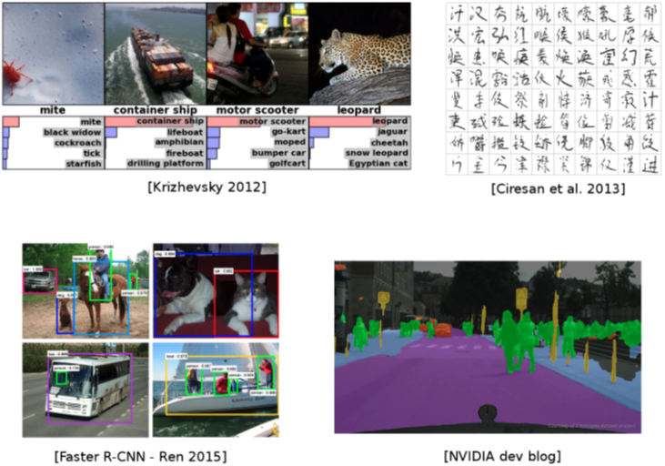
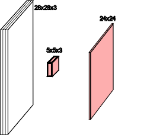
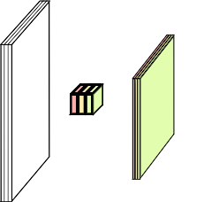

# Deep Learning: Convolutional Neural Networks

```
$ echo "Data Sciences Institute"
```

---

# Introduction: Why ConvNets?

* **Fully Connected Networks Challenges:**
  - High dimensionality of inputs (e.g., images)
  - Loss of spatial structure when flattening inputs

* **Convolutional Neural Networks (CNNs):**
  - Address high-dimensional input challenges
  - Preserve spatial structure through local receptive fields and parameter sharing
  - Efficient for image recognition and beyond due to reduced parameter count and computational efficiency

---
## Used everywhere for Vision



---
## Many other applications

* Speech recognition &amp; speech synthesis
* Natural Language Processing
* Protein/DNA binding prediction
* Any problem with a spatial (or sequential) structure

---
## ConvNets for image classification

CNN = Convolutional Neural Networks = ConvNet


LeCun, Y., Bottou, L., Bengio, Y., and Haffner, P. (1998). Gradient-based learning applied to document recognition.

---
# Outline

* Convolutions
* CNNs for Image Classification
* CNN Architectures

---

# Convolutions

---
## Motivations

Standard Dense Layer for an image input:

```python
x = Input((640, 480, 3), dtype='float32')
# shape of x is: (None, 640, 480, 3)
x = Flatten()(x)
# shape of x is: (None, 640 x 480 x 3)
z = Dense(1000)(x)
```

How many parameters in the Dense layer?

$640 \times 480 \times 3 \times 1000 + 1000 = 922M !$

Spatial organization of the input is destroyed by `Flatten`

---
### Fully Connected Network: MLP

```python
input_image = Input(shape=(28, 28, 1))
x = Flatten()(input_image)
x = Dense(256, activation='relu')(x)
x = Dense(10, activation='softmax')(x)
mlp = Model(inputs=input_image, outputs=x)
```

### Convolutional Network

```python
input_image = Input(shape=(28, 28, 1))
x = Conv2D(32, 5, activation='relu')(input_image) # 📍
x = MaxPool2D(2, strides=2)(x)                    # 📍
x = Conv2D(64, 3, activation='relu')(x)           # 📍
x = MaxPool2D(2, strides=2)(x)                    # 📍
x = Flatten()(x)
x = Dense(256, activation='relu')(x)
x = Dense(10, activation='softmax')(x)
convnet = Model(inputs=input_image, outputs=x)
```

2D spatial organization of features preserved untill `Flatten`.

---
## Convolution in a neural network


* $x$ is a $3 \times 3$ chunk (dark area) of the image *(blue array)*
* Each output neuron is parametrized with the $3 \times 3$ weight matrix $\mathbf{w}$ _(small numbers)

These slides extensively use convolution visualization by V.Dumoulin available at https://github.com/vdumoulin/conv_arithmetic

---

## Convolution in a neural network


* $x$ is a $3 \times 3$ chunk (dark area) of the image *(blue array)*
* Each output neuron is parametrized with the $3 \times 3$ weight matrix $\mathbf{w}$ _(small numbers)

The activation obtained by sliding the $3 \times 3$ window and computing:

$$
z(x) = relu(\mathbf{w}^T x + b)
$$

---

## Motivations

### Local connectivity
* A neuron depends only on a few local input neurons
* Translation invariance

### Comparison to Fully connected
* Parameter sharing: reduce overfitting
* Make use of spatial structure: **strong prior** for vision!

### Animal Vision Analogy

Hubel & Wiesel, RECEPTIVE FIELDS OF SINGLE NEURONES IN THE CAT'S STRIATE CORTEX (1959)

---
## Channels

Colored image = tensor of shape `(height, width, channels)`

Convolutions are usually computed for each channel and summed:



---
## Multiple convolutions


---
## Multiple convolutions


---
## Multiple convolutions




---
## Multiple convolutions


---
## Multiple convolutions


---

## Multiple convolutions


* Kernel size aka receptive field (usually 1, 3, 5, 7, 11)
* Output dimension: `length - kernel_size + 1`


---

## Strides

* Strides: increment step size for the convolution operator
* Reduces the size of the output map


Example with kernel size $3 \times 3$ and a stride of $2$ (image in blue)

---
## Padding

* Padding: artificially fill borders of image
* Useful to keep spatial dimension constant across filters
* Useful with strides and large receptive fields
* Usually: fill with 0s


---
## Pooling

* Spatial dimension reduction
* Local invariance
* No parameters: max or average of 2x2 units


Schematic from Stanford http://cs231n.github.io/convolutional-networks

---

## Pooling

* Spatial dimension reduction
* Local invariance
* No parameters: max or average of 2x2 units


---

# Architectures

---

## Classic ConvNet Architecture

* Input
* Conv blocks
  - Convolution + activation (relu)
  - Convolution + activation (relu)
  - ...
  - Maxpooling 2x2
* Output
  - Fully connected layers
  - Softmax

---

# AlexNet


First conv layer: kernel 11x11x3x96 stride 4

* Kernel shape: `(11,11,3,96)`
* Output shape: `(55,55,96)`
* Number of parameters: `34,944`
* Equivalent MLP parameters: `43.7 x 1e9`

Simplified version of Krizhevsky, Alex, Sutskever, and Hinton. "Imagenet classification with deep convolutional neural networks." NIPS 2012

---

## AlexNet


```md
INPUT:     [227x227x3]
CONV1:     [55x55x96]   96 11x11 filters at stride 4, pad 0
MAX POOL1: [27x27x96]      3x3   filters at stride 2
CONV2:     [27x27x256] 256 5x5   filters at stride 1, pad 2
MAX POOL2: [13x13x256]     3x3   filters at stride 2
CONV3:     [13x13x384] 384 3x3   filters at stride 1, pad 1
CONV4:     [13x13x384] 384 3x3   filters at stride 1, pad 1
CONV5:     [13x13x256] 256 3x3   filters at stride 1, pad 1
MAX POOL3: [6x6x256]       3x3   filters at stride 2
FC6:       [4096]      4096 neurons
FC7:       [4096]      4096 neurons
FC8:       [1000]      1000 neurons (softmax logits)
```

---

## Hierarchical representation


---

## VGG-16


Simonyan, Karen, and Zisserman. "Very deep convolutional networks for large-scale image recognition." (2014)

---

## VGG in Keras

```python
    model.add(Convolution2D(64, 3, 3, activation='relu',input_shape=(3,224,224)))
    model.add(Convolution2D(64, 3, 3, activation='relu'))
    model.add(MaxPooling2D((2,2), strides=(2,2)))

    model.add(Convolution2D(128, 3, 3, activation='relu'))
    model.add(Convolution2D(128, 3, 3, activation='relu'))
    model.add(MaxPooling2D((2,2), strides=(2,2)))

    model.add(Convolution2D(256, 3, 3, activation='relu'))
    model.add(Convolution2D(256, 3, 3, activation='relu'))
    model.add(Convolution2D(256, 3, 3, activation='relu'))
    model.add(MaxPooling2D((2,2), strides=(2,2)))

    model.add(Convolution2D(512, 3, 3, activation='relu'))
    model.add(Convolution2D(512, 3, 3, activation='relu'))
    model.add(Convolution2D(512, 3, 3, activation='relu'))
    model.add(MaxPooling2D((2,2), strides=(2,2)))

    model.add(Convolution2D(512, 3, 3, activation='relu'))
    model.add(Convolution2D(512, 3, 3, activation='relu'))
    model.add(Convolution2D(512, 3, 3, activation='relu'))
    model.add(MaxPooling2D((2,2), strides=(2,2)))

    model.add(Flatten())
    model.add(Dense(4096, activation='relu'))
    model.add(Dropout(0.5))
    model.add(Dense(4096, activation='relu'))
    model.add(Dropout(0.5))
    model.add(Dense(1000, activation='softmax'))
```

---

## Memory and Parameters

```md
           Activation maps          Parameters
INPUT:     [224x224x3]   = 150K     0
CONV3-64:  [224x224x64]  = 3.2M     (3x3x3)x64    =       1,728
CONV3-64:  [224x224x64]  = 3.2M     (3x3x64)x64   =      36,864
POOL2:     [112x112x64]  = 800K     0
CONV3-128: [112x112x128] = 1.6M     (3x3x64)x128  =      73,728
CONV3-128: [112x112x128] = 1.6M     (3x3x128)x128 =     147,456
POOL2:     [56x56x128]   = 400K     0
CONV3-256: [56x56x256]   = 800K     (3x3x128)x256 =     294,912
CONV3-256: [56x56x256]   = 800K     (3x3x256)x256 =     589,824
CONV3-256: [56x56x256]   = 800K     (3x3x256)x256 =     589,824
POOL2:     [28x28x256]   = 200K     0
CONV3-512: [28x28x512]   = 400K     (3x3x256)x512 =   1,179,648
CONV3-512: [28x28x512]   = 400K     (3x3x512)x512 =   2,359,296
CONV3-512: [28x28x512]   = 400K     (3x3x512)x512 =   2,359,296
POOL2:     [14x14x512]   = 100K     0
CONV3-512: [14x14x512]   = 100K     (3x3x512)x512 =   2,359,296
CONV3-512: [14x14x512]   = 100K     (3x3x512)x512 =   2,359,296
CONV3-512: [14x14x512]   = 100K     (3x3x512)x512 =   2,359,296
POOL2:     [7x7x512]     =  25K     0
FC:        [1x1x4096]    = 4096     7x7x512x4096  = 102,760,448
FC:        [1x1x4096]    = 4096     4096x4096     =  16,777,216
FC:        [1x1x1000]    = 1000     4096x1000     =   4,096,000

TOTAL activations: 24M x 4 bytes ~=  93MB / image (x2 for backward)
TOTAL parameters: 138M x 4 bytes ~= 552MB (x2 for plain SGD, x4 for Adam)
```

---

## Memory and Parameters

```md
           Activation maps          Parameters
INPUT:     [224x224x3]   = 150K     0
CONV3-64:  [224x224x64]  = 3.2M     (3x3x3)x64    =       1,728 # 📍
CONV3-64:  [224x224x64]  = 3.2M     (3x3x64)x64   =      36,864 # 📍
POOL2:     [112x112x64]  = 800K     0
CONV3-128: [112x112x128] = 1.6M     (3x3x64)x128  =      73,728
CONV3-128: [112x112x128] = 1.6M     (3x3x128)x128 =     147,456
POOL2:     [56x56x128]   = 400K     0
CONV3-256: [56x56x256]   = 800K     (3x3x128)x256 =     294,912
CONV3-256: [56x56x256]   = 800K     (3x3x256)x256 =     589,824
CONV3-256: [56x56x256]   = 800K     (3x3x256)x256 =     589,824
POOL2:     [28x28x256]   = 200K     0
CONV3-512: [28x28x512]   = 400K     (3x3x256)x512 =   1,179,648
CONV3-512: [28x28x512]   = 400K     (3x3x512)x512 =   2,359,296
CONV3-512: [28x28x512]   = 400K     (3x3x512)x512 =   2,359,296
POOL2:     [14x14x512]   = 100K     0
CONV3-512: [14x14x512]   = 100K     (3x3x512)x512 =   2,359,296
CONV3-512: [14x14x512]   = 100K     (3x3x512)x512 =   2,359,296
CONV3-512: [14x14x512]   = 100K     (3x3x512)x512 =   2,359,296
POOL2:     [7x7x512]     =  25K     0
FC:        [1x1x4096]    = 4096     7x7x512x4096  = 102,760,448 # 📍
FC:        [1x1x4096]    = 4096     4096x4096     =  16,777,216
FC:        [1x1x1000]    = 1000     4096x1000     =   4,096,000

TOTAL activations: 24M x 4 bytes ~=  93MB / image (x2 for backward)
TOTAL parameters: 138M x 4 bytes ~= 552MB (x2 for plain SGD, x4 for Adam)
```

---

## ResNet


Even deeper models:

34, 50, 101, 152 layers

Source: He, Kaiming, et al. "Deep residual learning for image recognition." CVPR. 2016.


---

## ResNet


A block learns the residual w.r.t. identity


* Good optimization properties

Source: He, Kaiming, et al. "Deep residual learning for image recognition." CVPR. 2016.

---

## ResNet


### ResNet50 Compared to VGG:

* Superior accuracy in all vision tasks **5.25%** top-5 error vs 7.1%
* Less parameters **25M** vs 138M
* Computational complexity **3.8B Flops** vs 15.3B Flops
* Fully Convolutional until the last layer

Source: He, Kaiming, et al. "Deep residual learning for image recognition." CVPR. 2016.

---

## Deeper is better


from Kaiming He slides "Deep residual learning for image recognition." ICML. 2016.

---

## State of the art

* Finding right architectures: Active area of research


Modular building blocks engineering
see also DenseNets, Wide ResNets, Fractal ResNets, ResNeXts,
  Pyramidal ResNets

Source: from  He slides "Deep residual learning for image recognition." ICML. 2016.

---

## State of the art

#### Top 1-accuracy, performance and size on ImageNet


See also: https://paperswithcode.com/sota/image-classification-on-imagenet

Canziani, Paszke, and Culurciello. "An Analysis of Deep Neural Network Models for Practical Applications." (May 2016).

---

## More ImageNet SOTA

 

* Mingxing Tan, Quoc V. Le, [EfficientNet: Rethinking Model Scaling for Convolutional Neural Networks](https://arxiv.org/abs/1905.11946), ICML 2019.
* Irwan Bello, [LambdaNetworks: Modeling long-range Interactions without Attention](https://openreview.net/forum?id=xTJEN-ggl1b), ICLR 2021
* Dosovitskiy A. et al, [An Image is worth 16X16 Words: Transformers for Image Recognition at Scale](https://arxiv.org/pdf/2010.11929.pdf), ICLR 2021

---

## State of the art


Meta Pseudo Labels, Hieu Pham et al. (Jan 2021)

---

# Pre-trained models

---

## Pre-trained models

Training a model on ImageNet from scratch takes **days or weeks**.
Many models trained on ImageNet and their weights are publicly
available!

### Transfer learning

* Use pre-trained weights, remove last layers to compute representations of images
* Train a classification model from these features on a new classification task
* The network is used as a generic feature extractor
* Better than handcrafted feature extraction on natural images

---
## Pre-trained models

Training a model on ImageNet from scratch takes **days or weeks**.
Many models trained on ImageNet and their weights are publicly
available!

### Fine-tuning

Retraining the (some) parameters of the network (given enough data)
* Truncate the last layer(s) of the pre-trained network
* Freeze the remaining layers weights
* Add a (linear) classifier on top and train it for a few epochs
* Then fine-tune the whole network or the few deepest layers
* Use a smaller learning rate when fine tuning

---
## Data Augmentation


See also: [RandAugment](https://arxiv.org/abs/1909.13719) and
[Unsupervised Data Augmentation for Consistency Training](https://arxiv.org/abs/1904.12848).

<!-- 
* Use prior knowledge on label-invariant transformation
* A rotated picture of a cat is still a picture of a cat.
* Effective way to reduce overfitting on small labeled sets.
* Can be very efficient in a Semi-Supervised setting when combined with a consistency loss. 
-->

---

## Data Augmentation

With Keras:

```python
from keras.preprocessing.image import ImageDataGenerator

image_gen = ImageDataGenerator(
    rescale=1. / 255,
    rotation_range=40,
    width*shift*range=0.2,
    height*shift*range=0.2,
    shear_range=0.2,
    zoom_range=0.2,
    horizontal_flip=True,
    channel*shift*range=9,
    fill_mode='nearest'
)

train*flow = image*gen.flow*from*directory(train_folder)
model.fit*generator(train*flow, train_flow.n)
```

---

# Next: Lab 4!
