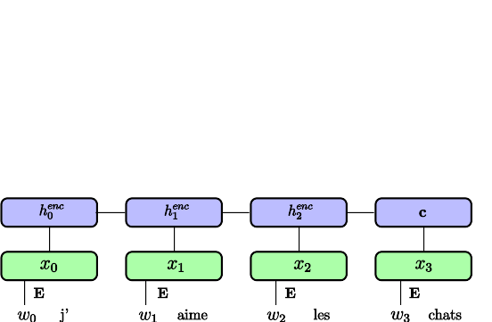
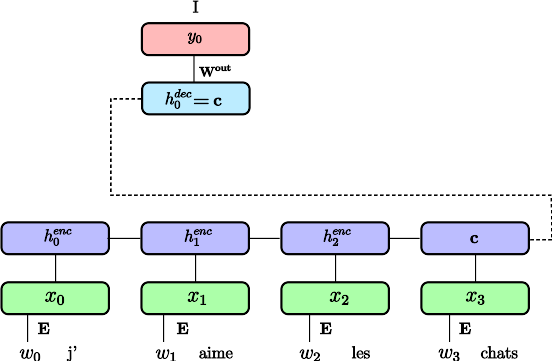
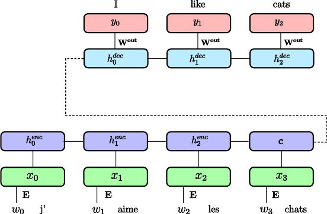

# Deep Learning: Sequences, Attention and Transformers

```
$ echo "Data Sciences Institute"
```

---

## Reminder: Recurrent Neural Networks


takes a sequence as input 
may output a single value, or a value for each time-step of the input

---

## Outline

* Encoder-decoder for machine translation
* Attention mechanisms
* Self-attention and Transformer

---

# Encoder-Decoder for machine translation

From sequence to sequence

---

## Decoder-only Seq2Seq


- Trained via **Teacher Forcing**:
  - Feed the ground-truth translation as input at each time-step
  - The model is trained to predict the next word in the target sequence
- Special symbols for starting decoding and end of sentence

Sutskever, Ilya, Oriol Vinyals, and Quoc V. Le. "Sequence to sequence learning with neural networks." NIPS 2014

---

## Encoder-Decoder Seq2Seq




Cho, Kyunghyun, et al. "Learning phrase representations using RNN encoder-decoder for statistical machine translation." 2014


---

## Encoder-Decoder Seq2Seq



Cho, Kyunghyun, et al. "Learning phrase representations using RNN encoder-decoder for statistical machine translation." 2014

---

## Encoder-Decoder Seq2Seq



Cho, Kyunghyun, et al. "Learning phrase representations using RNN encoder-decoder for statistical machine translation." 2014

---

## Encoder-Decoder Seq2Seq


Cho, Kyunghyun, et al. "Learning phrase representations using RNN encoder-decoder for statistical machine translation." 2014

---

## Large Vocabulary Size

**Softmax** computation becomes **intractable** both at training and
inference time (sum over $|V|$).
**Negative Sampling** works well to learn word embeddings but is **not a
good approximation** for **language modeling** and machine translation.

Approximate softmax with **sampled softmax** (a.k.a. bucketing):

  - Accumulate train sequences in buckets $i \in B$ with $|V_i| ~= 50k$;
  - Sample bucket $i$ at random and train with regular softmax on $V_i$;
  - Share softmax parameters for words in common across buckets;
  - Iterate untill the end of the training set.

<!-- Sampled softmax (https://arxiv.org/abs/1412.2007):
  - Biased estimate, but works reasonably well in practice;
  - Also useful to train item embedding in RecSys. -->

---

## Alternative to Word Embeddings

Character-level Embedding (possibly with a CNN layer)

- (+) Much smaller vocabulary size (faster softmax)
- (+) No need for language specific segmentation (e.g. Chinese);
- (+) Robust to spelling mistakes and out-of-vocabulary words;
- (+) Can deal with mixed language contents.

However

- (-) Need to learn word structure from data;
- (-) Decoding more complex and expensive.

Sub-word representations and **Byte Pair Encoding** (BPE) are better

<!-- BPE (https://arxiv.org/abs/1508.07909):

- Start with a vocabulary of characters (encoded as bytes);
- Scan training set to compute most frequent char bigrams and replace
  them with a new single byte symbol;
- Recurse until target vocabulary size is reached (hyper-parameter). -->

---

# Attention Mechanism

---

# Attention Mechanism

Main problem with Encoder-Decoder:
- A sentence may have different parts with different concepts
- The **whole sentence** is represented as a **single vector**

*I like cats but I don't like dogs*

# Solution:

- Use all outputs of the encoder $\{h_i\}$ to compute the outputs
- Build an **Attention Mechanism** to determine which output(s) to attend to

In depth explanation on https://blog.heuritech.com/2016/01/20/attention-mechanism/

---

# Attention Mechanism


- Goal : select most relevant vector(s) given context $\mathbf{c}$

---

# Attention Mechanism


- $f_{att}$ may be a cosine similarity, a deep network, etc.
- softmax enables to normalize and focus on very few items

---
# Attention Mechanism


Compute a soft (differentiable) selection on a set of vectors

---

# Visualizing Attention


Neural machine translation by jointly learning to align and translate, D Bahdanau, K Cho, Y Bengio 2014

---

# The GNMT architecture (2016)


Yonghui Wu et al. "Google's Neural Machine Translation System: Bridging
the Gap between Human and Machine Translation"

<!-- 
- bi LSTM
- stack LSTM GPU
- reLU
- inference TPU 
-->

---

# Image Captioning


Xu, Kelvin, et al. "Show, Attend and Tell: Neural Image Caption Generation with Visual Attention." ICML. 2015

---

# Self-attention and transformer

---

# Self-Attention

For each element of an input sequence ${X_i}$ project into 3 vectors: 🟦 query, 🟥 key and 🟩 value


For each element, compute attention over all other vectors

$$SelfAttention(Q_i, \mathbf{K}, \mathbf{V}) = \sum_j softmax_j(\frac{Q_i \cdot \mathbf{K}^T}{\sqrt{d_k}}) V_j $$

Attention Is All You Need Ashish Vaswani et al. NIPS 2017

---

# Single-head self-attention


Adapted from Emma Strubell EMNLP 2018


---

# Multi-head self-attention


Adapted from Emma Strubell EMNLP 2018

---

### Transformer Architecture


Attention Is All You Need Ashish Vaswani et al. NIPS 2017

---

# Transformer tricks

No notion of word order. Positional encoding need to be added:


May also learn the embedding

---

# Transformer based language models

*Pretrained transformers* for transfer learning, like "ImageNet-pretrained convnets" for NLP


Most recent models https://github.com/huggingface/transformers

GLUE : a multi-task benchmark and analysis platform for natural language processing, Alex Wang et al. ICLR 2019
BERT : Pre-training of Deep Bidirectional Transformers for Language Understanding, Jacob Devlin et al. 2018
GPT2 : https://openai.com/blog/better-language-models/

---

# BERT


Slide from Thomas Wolf (HuggingFace)

---

# Takeaways

- Seq2Seq: variable number of input and ouput tokens
- Decoder-only vs Encoder-Decoder
- Decoder always trained by **Teacher Forcing**
- Can use either RNN or **Transformers** with *causal* attention
- Autogressive language modeling (GPT)

---

# Next: Lab 7!
