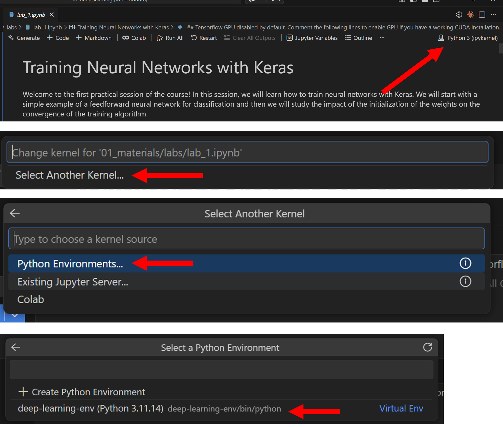
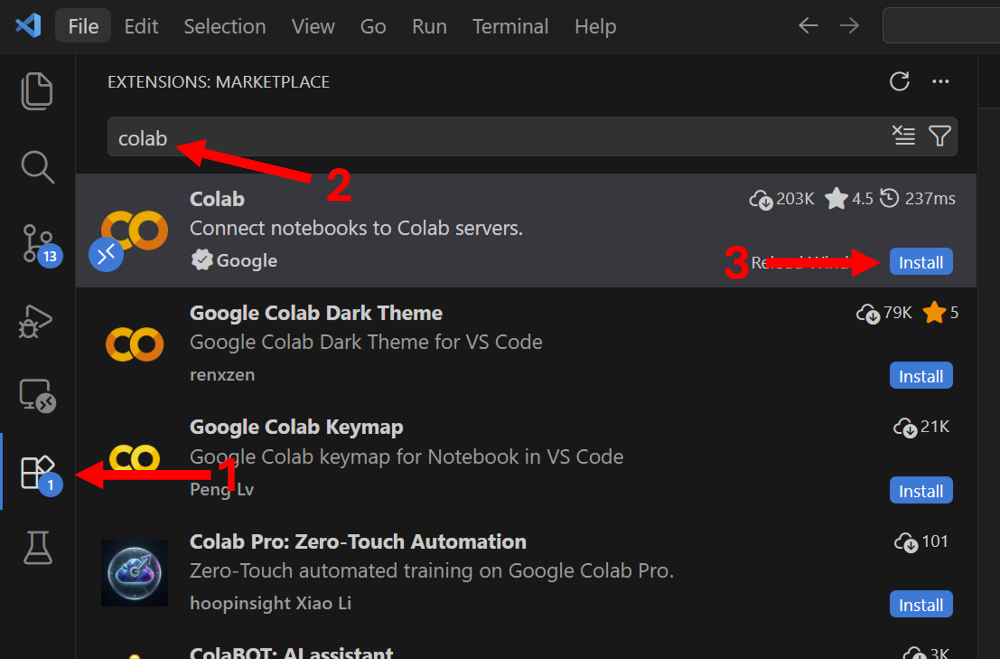
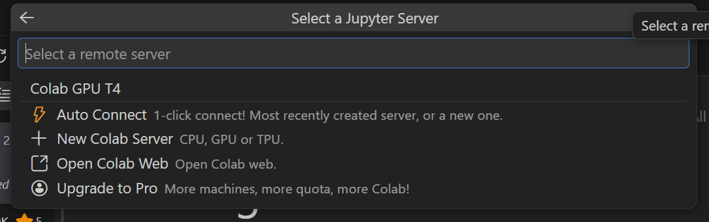

# Setup


## Virtual Environment Setup Guide
Before using this repo, make sure you’ve completed the [environment setup guide](https://github.com/UofT-DSI/onboarding/blob/main/environment_setup/README.md), which installs the core tools you’ll need for this module, such as:

- Git  
- Git Bash (for Windows)  
- Visual Studio Code
- UV

### Necessary Packages
The Deep Learning module uses its own isolated environment called `deep-learning-env` so that packages don’t conflict with other projects. 
We use UV to create this environment, activate it, and install the required packages listed in the module’s `pyproject.toml`.  
This setup only needs to be done **once per module**, after that, you just activate the environment whenever you want to work in this repo.  

Open a terminal (macOS/Linux) or Git Bash (Windows) in this repo, and run the following commands in order:

1. Create a virtual environment called `deep-learning-env`:
    ```
    uv venv deep-learning-env --python 3.11
    ```

2. Activate the environment:
    - for macOS/Linux:
        ```
        source deep-learning-env/bin/activate
        ```
        
    - for windows (git bash):    
        ```
        source deep-learning-env/Scripts/activate
        ```

3. Install all required packages from the [pyproject.toml](./pyproject.toml)
    ```bash
    uv sync --active
    ```

### Environment Usage
In order to run any code in this repo, you must first activate its environment.
- for macOS/Linux:
    ```
    source deep-learning-env/bin/activate
    ```
    
- for windows (git bash):    
    ```
    source deep-learning-env/Scripts/activate
    ```

When the environment is active, your terminal prompt will change to show:  
```
(deep-learning-env) $
```
This is your **visual cue** that you’re working inside the right environment.  

When you’re finished, you can deactivate it with:  
```bash
deactivate
```

> **👉 Remember**   
> Only one environment can be active at a time. If you switch to a different repo, first deactivate this one (or just close the terminal) and then activate the new repo’s environment.
> 
### Environments and Notebooks



To use your virtual environment in a notebook, click the kernel selection dropdown, select `Python Environments`, then click the `deep-learning-env` from the dropdown. Then restart your notebook.


## Colab
An alternative to setting up your virtual environment is to instead use Google Colab. Colab is a free, cloud-based Jupyter notebook environment provided by Google that runs entirely in your browser. It requires minimal, just a Google account. Colab provides access to GPUs and TPUs, which can significantly speed up training deep learning models. 

You can access a Colab kernel for your notebooks by installing the Colab extension in VSCode:



Once you have installed this kernel, you can click the kernel dropdown in your notebook, click `Select Another Kernel`, and select `Colab`. You will see a dropdown 



This will ask you to log into a Google account, simply follow the dropdown. For normal usage, click `Auto-Connect`. Otherwise click `New Colab Server` and select `CPU`,`GPU`, or `TPU`. For this course, using `GPU` may be useful if you have not installed GPU drivers. 

**Pros and Cons** Colab is very convenient as it has many packages pre-installed. However, there are some downsides: 
* This does not work offline and requires you to be connected to the internet. 
* Colab is limited to notebooks and you cannot utilize it to run scripts. 
* This is run on Google's servers, making it unsuitable for applications where data security is important. 

---


For questions or issues, please contact the Deep Learning Module learning support team or email courses.dsi@utoronto.ca.
